# Suite Integral de Procesos de Negocio BPMN 2.0 — SENA: Gestión de Horarios
## Especificación Formal de Procesos, Microservicios, Roles y Trazabilidad de las 53 Pantallas

---

## 1. Justificación y Marco de Modelado BPMN 2.0

Para el diseño del sistema **SENA — Gestión de Horarios**, no basta con un diagrama genérico superficial; el ecosistema opera bajo una arquitectura de **Microservicios Desacoplados**, **Microfrontends (MFE)** y un modelo de seguridad **RBAC granular** (62 features distribuidas en 7 roles).

A continuación se descomponen **14 Procesos de Negocio BPMN 2.0 Reales, Granulares y Explicables**, diseñados para cubrir con rigor metodológico:
1. **Los 6 Roles Institucionales**: Usuario Público, Coordinador Académico, Instructor, Aprendiz, Director de Centro, Administrador de Soporte (Back-Office) y Administrador de Sistema.
2. **Las 53 Pantallas y Modales** del prototipo navegable oficial ([`review.html`](file:///C:/Users/Aprendiz/.gemini/antigravity/scratch/design-software-mockup/v2/review.html) / [`v2/index.html#/inventory`](file:///C:/Users/Aprendiz/.gemini/antigravity/scratch/design-software-mockup/v2/index.html)).
3. **Los 8 Microservicios del Backend**: `iam-service`, `scheduling-service`, `environment-service`, `academic-service`, `monitoring-service`, `document-service`, `audit-service` y `reference-service`.
4. **La Máquina de Estados del Dominio**: Ciclos de vida de Horarios (`DRAFT` $\rightarrow$ `UNDER_REVIEW` $\rightarrow$ `PUBLISHED` $\rightarrow$ `ARCHIVED`), Conflictos (`PENDING` $\rightarrow$ `RESOLVED`), Excepciones (`PENDING` $\rightarrow$ `APPROVED`/`REJECTED`/`CANCELLED`) y Documentos (`GENERATING` $\rightarrow$ `AVAILABLE`/`GENERATION_FAILED`).

---

## 2. Índice de los 14 Procesos BPMN 2.0

- **Proceso 01**: Autenticación, Recuperación de Clave y Control de Sesión (Pantallas 1, 2, 3, 6, 33)
- **Proceso 02**: Navegación en App Shell, Guards RBAC y Panel de Notificaciones (Pantallas 4, 5, 6, 53)
- **Proceso 03**: Formulación y Estructuración de Horarios Académicos (Pantallas 7, 8, 10, 11, 18)
- **Proceso 04**: Motor de Detección y Clasificación de Conflictos de Programación (Pantallas 10, 13)
- **Proceso 05**: Resolución Auditada de Conflictos y Validación Pre-Publicación (Pantallas 13, 14, 10)
- **Proceso 06**: Confirmación, Publicación y Difusión de Horarios (Pantallas 10, 12, 9, 26, 28)
- **Proceso 07**: Gestión de Capacidad, Disponibilidad y Mantenimiento de Ambientes (Pantallas 15, 16, 49)
- **Proceso 08**: Gestión de Disponibilidad Docente y Trámite de Excepciones (Pantallas 21, 22, 15, 51)
- **Proceso 09**: Ejecución Formativa, Asistencia y Seguimiento Curricular por el Instructor (Pantallas 19, 20, 23, 24)
- **Proceso 10**: Experiencia del Aprendiz: Consulta de Horario y Gestión de Avisos (Pantallas 25, 26, 27, 28)
- **Proceso 11**: Gobierno Directivo: Monitoreo de KPIs, Drill-down y Gestión de Alertas (Pantallas 29, 30, 50)
- **Proceso 12**: Administración de Cuentas, Asignación de Roles y Control de Acceso RBAC (Pantallas 31, 32, 33, 34, 53)
- **Proceso 13**: Ciclo de Vida de Documentación Oficial y Gestión de Plantillas (Pantallas 37, 38, 41, 42, 43)
- **Proceso 14**: Parametrización Maestra: Geografía, Currículo, Franjas y Catálogos (Pantallas 46, 47, 48, 50, 51, 52, 35, 36, 40, 45)

---

## 3. Especificación y Diagramas BPMN 2.0 por Proceso

---

### PROCESO 01: Autenticación, Recuperación de Clave y Control de Sesión
> **Pantallas involucradas**: [1] Login, [2] Recuperar contraseña, [3] Nueva contraseña, [6] Estados globales (Sesión expirada), [33] Detalle de usuario (Sesiones activas).
> **Microservicio**: `iam-service` (Identity & Access Management).

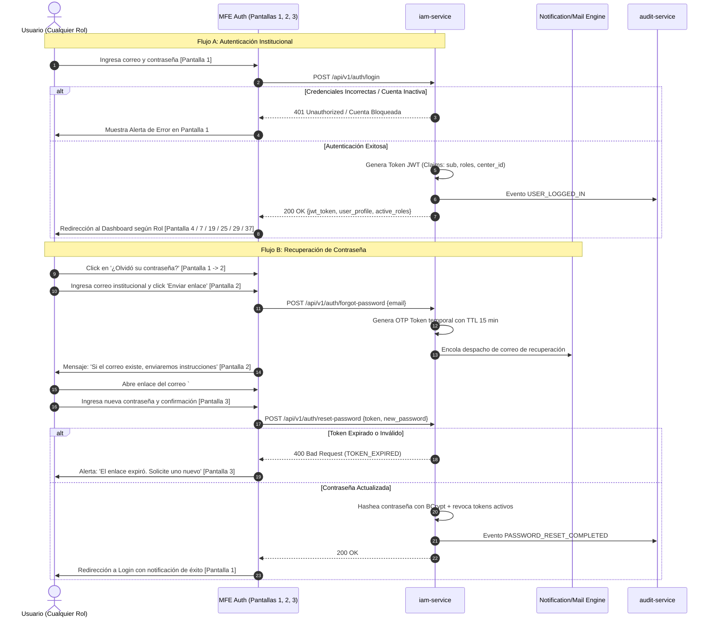

---

### PROCESO 02: Navegación en App Shell, Guards RBAC y Notificaciones
> **Pantallas involucradas**: [4] App Shell por rol, [5] Panel de notificaciones, [6] Estados globales (403, 404, 500), [53] RBAC.
> **Microservicio**: `api-gateway` + `iam-service` + `monitoring-service`.

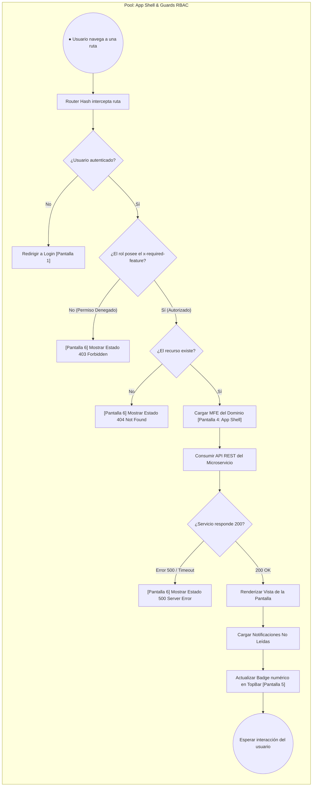

---

### PROCESO 03: Formulación y Estructuración de Horarios Académicos
> **Pantallas involucradas**: [7] Dashboard / Inicio, [8] Horarios — lista, [10] Crear / editar horario, [11] Modal agregar / editar sesión, [18] Detalle de ficha.
> **Microservicio**: `scheduling-service`, `academic-service`, `environment-service`.

```mermaid
flowchart TD
    subgraph POOL_SCHED_BUILD["Pool: Formulación de Horario (Borrador)"]
        direction TB
        subgraph LANE_COORD["Lane: Coordinador Académico"]
            START_BUILD((● Inicio)) --> P7["[7] Dashboard / Inicio"]
            P7 --> CLICK_NEW["Click en 'Nuevo Horario'"]
            CLICK_NEW --> P10_NEW["[10] Pantalla Crear Horario (Estado: DRAFT)"]
            
            P10_NEW --> SELECT_FICHA["Seleccionar Ficha Académica (ej. 2874412 ADSO)"]
            SELECT_FICHA --> INPUT_HEADER["Ingresar Período (2026-2) y Nombre del Horario"]
            
            INPUT_HEADER --> CLICK_ADD_SESS["Click en '+ Agregar Sesión'"]
            CLICK_ADD_SESS --> P11["[11] Modal Agregar / Editar Sesión"]
            
            P11 --> FORM_SESS["Diligenciar: Competencia, Instructor, Ambiente, Franja, Fecha y Notas"]
            FORM_SESS --> CLICK_SAVE_SESS["Click en 'Agregar Sesión'"]
            
            CLICK_SAVE_SESS --> P10_GRID["[10] Actualiza Grilla de Sesiones del Horario"]
            P10_GRID --> DEC_MORE_SESS{¿Desea agregar más sesiones?}
            
            DEC_MORE_SESS -- Sí --> CLICK_ADD_SESS
            DEC_MORE_SESS -- No --> CLICK_SAVE_DRAFT["Click en 'Guardar Borrador'"]
            
            CLICK_SAVE_DRAFT --> CALL_SAVE["scheduling-service: Guarda Horario en DRAFT"]
            CALL_SAVE --> P8["[8] Redirección a Horarios — Lista"]
            P8 --> END_DRAFT(((● Horario Guardado en Borrador)))
        end
    end
```

---

### PROCESO 04: Motor de Detección y Clasificación de Conflictos
> **Pantallas involucradas**: [10] Crear / editar horario, [13] Panel de conflictos.
> **Microservicio**: `scheduling-service` (Rules Engine) + `environment-service` + `actors-service`.

```mermaid
flowchart TD
    subgraph POOL_CONFLICT_ENGINE["Pool: Motor de Reglas y Detección de Conflictos"]
        direction TB
        START_ENGINE((● Disparador: Click en 'Validar' en Pantalla 10)) --> RULE_RUN["scheduling-service: Inicia Evaluación de Restricciones"]
        
        RULE_RUN --> EVAL_1{¿Instructor con 2 sesiones en la misma franja?}
        EVAL_1 -- Sí --> GEN_CONF1["Generar Conflicto: INSTRUCTOR_DOUBLE_BOOKED (Severidad: ALTA | Bloqueante: SÍ)"]
        EVAL_1 -- No --> EVAL_2
        
        GEN_CONF1 --> EVAL_2{¿Ambiente reservado por 2 fichas en la misma franja?}
        EVAL_2 -- Sí --> GEN_CONF2["Generar Conflicto: ENVIRONMENT_DOUBLE_BOOKED (Severidad: ALTA | Bloqueante: SÍ)"]
        EVAL_2 -- No --> EVAL_3
        
        GEN_CONF2 --> EVAL_3{¿Sesiones de la misma ficha solapadas?}
        EVAL_3 -- Sí --> GEN_CONF3["Generar Conflicto: SESSIONS_OVERLAP (Severidad: MEDIA | Bloqueante: SÍ)"]
        EVAL_3 -- No --> EVAL_4
        
        GEN_CONF3 --> EVAL_4{¿Ambiente programado durante Mantenimiento?}
        EVAL_4 -- Sí --> GEN_CONF4["Generar Conflicto: ENVIRONMENT_MAINTENANCE (Severidad: MEDIA | Bloqueante: NO)"]
        EVAL_4 -- No --> EVAL_5
        
        GEN_CONF4 --> EVAL_5{¿Instructor con < 30 min para cambio de sede?}
        EVAL_5 -- Sí --> GEN_CONF5["Generar Conflicto: INSTRUCTOR_TRAVEL_CONFLICT (Severidad: ALTA | Bloqueante: SÍ)"]
        EVAL_5 -- No --> EVAL_6
        
        GEN_CONF5 --> EVAL_6{¿Instructor con excepción médica/comisión aprobada?}
        EVAL_6 -- Sí --> GEN_CONF6["Generar Conflicto: INSTRUCTOR_UNAVAILABLE (Severidad: ALTA | Bloqueante: SÍ)"]
        EVAL_6 -- No --> CONSOLIDATE
        GEN_CONF6 --> CONSOLIDATE
        
        CONSOLIDATE["Consolidar Matriz de Conflictos y Persistir en BD"] --> DEC_EMPTY{¿Se encontraron conflictos?}
        
        DEC_EMPTY -- Sí --> SET_REVIEW["Cambiar Estado a UNDER_REVIEW"]
        SET_REVIEW --> P13["[13] Desplegar Panel de Conflictos"]
        
        DEC_EMPTY -- No --> SET_READY["Habilitar Botón 'Publicar' en Pantalla 10"]
        SET_READY --> END_ENGINE(((● Validación Concluida)))
    end
```

---

### PROCESO 05: Resolución Auditada de Conflictos y Revalidación
> **Pantallas involucradas**: [13] Panel de conflictos, [14] Modal resolver conflicto, [10] Crear / editar horario.
> **Microservicio**: `scheduling-service` + `audit-service`.

```mermaid
flowchart TD
    subgraph POOL_RESOLVE["Pool: Resolución de Conflictos y Revalidación"]
        direction TB
        subgraph LANE_COORD_RESOLVE["Lane: Coordinador Académico"]
            START_RES_CONF((● En Panel de Conflictos [Pantalla 13])) --> VIEW_LIST["Inspecciona tarjetas de conflictos pendientes"]
            VIEW_LIST --> SELECT_CONF["Click en 'Resolver...' sobre tarjeta de conflicto"]
            
            SELECT_CONF --> P14["[14] Modal Resolver Conflicto"]
            P14 --> READ_DETAILS["Lee detalles del cruce (Sesión 1 vs Sesión 2, Horas, Recursos)"]
            READ_DETAILS --> INPUT_JUST["Diligencia Justificación Obligatoria de la Resolución"]
            
            INPUT_JUST --> CONFIRM_RES["Click en 'Confirmar Resolución'"]
            CONFIRM_RES --> CALL_RES_API["scheduling-service: PUT /api/v1/conflicts/{id}/resolve"]
            
            CALL_RES_API --> AUDIT_LOG["audit-service: Registra evento CONFLICT_RESOLVED (Actor, Fecha, Motivo)"]
            AUDIT_LOG --> RECHECK{¿Quedan conflictos bloqueantes pendientes?}
            
            RECHECK -- Sí --> P13_UPD["[13] Actualiza lista de conflictos (Marca tarjeta en Verde Resuelto)"]
            P13_UPD --> VIEW_LIST
            
            RECHECK -- No (0 Bloqueos) --> P10_OK["[10] Retorna al Horario con banner: 'Sin conflictos pendientes — listo para publicar'"]
            P10_OK --> END_RES(((● Listo para Publicación)))
        end
    end
```

---

### PROCESO 06: Confirmación, Publicación y Difusión de Horarios
> **Pantallas involucradas**: [10] Editor de horario, [12] Modal confirmar publicación, [9] Detalle de horario (Solo lectura), [26] Notificaciones aprendiz, [28] Detalle notificación.
> **Microservicio**: `scheduling-service` $\rightarrow$ Kafka Topic `schedules.lifecycle` $\rightarrow$ `monitoring-service` / `document-service`.

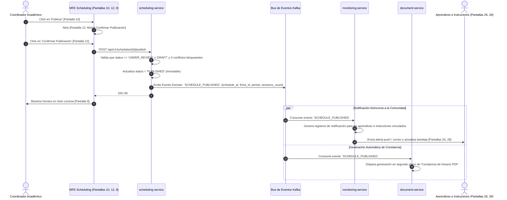

---

### PROCESO 07: Gestión de Capacidad, Disponibilidad y Ambientes
> **Pantallas involucradas**: [15] Disponibilidad, [16] Detalle de ambiente, [49] Tipos de ambiente e inventario.
> **Microservicio**: `environment-service` + `scheduling-service`.

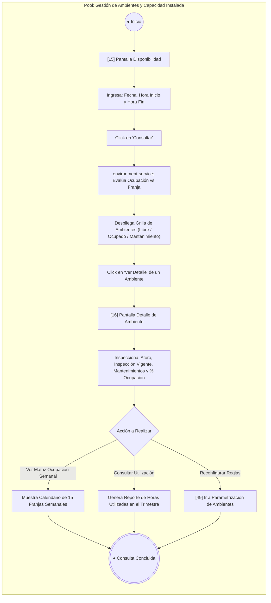

---

### PROCESO 08: Trámite de Excepciones de Disponibilidad Docente
> **Pantallas involucradas**: [21] Mi disponibilidad, [22] Modal crear excepción, [15] Disponibilidad del centro, [51] Estados de actores.
> **Microservicio**: `actors-service` (Instructor Lifecycle) + `document-service`.

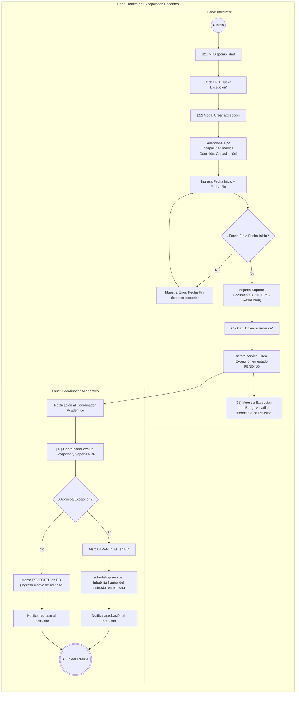

---

### PROCESO 09: Ejecución de Clases y Seguimiento Curricular (Instructor)
> **Pantallas involucradas**: [19] Mi horario — semana, [20] Detalle de sesión (Drawer), [23] Seguimiento de ficha, [24] Modal registrar seguimiento.
> **Microservicio**: `scheduling-service` + `monitoring-service`.

```mermaid
flowchart TD
    subgraph POOL_TEACHING["Pool: Operación de Clases y Seguimiento Curricular"]
        direction TB
        subgraph LANE_INSTR_OP["Lane: Instructor de Formación"]
            START_TEACH((● Inicio de Jornada)) --> P19["[19] Mi Horario — Semana (Calendario de Clases)"]
            P19 --> CLICK_CLASS["Selecciona Sesión del Día"]
            CLICK_CLASS --> P20["[20] Drawer Detalle de Sesión"]
            
            P20 --> EXEC_CLASS["Imparte la sesión de formación en el ambiente asignado"]
            EXEC_CLASS --> DEC_CLASS_DONE{¿Se ejecutó la clase?}
            
            DEC_CLASS_DONE -- Sí --> MARK_DONE["Click en 'Marcar Ejecutada'"]
            MARK_DONE --> Sched_OK["scheduling-service: Actualiza estado a EXECUTED"]
            
            DEC_CLASS_DONE -- No (Cancelada / Ausencia) --> MARK_CANCEL["Click en 'No Ejecutada' (Registra Motivo)"]
            MARK_CANCEL --> Sched_NOK["scheduling-service: Actualiza estado a CANCELLED"]
            
            Sched_OK --> GOTO_TRK["Navega a Módulo de Seguimiento"]
            P19 --> GOTO_TRK
            GOTO_TRK --> P23["[23] Seguimiento de Ficha"]
            
            P23 --> CLICK_ADD_TRK["Click en '+ Registrar Seguimiento'"]
            CLICK_ADD_TRK --> P24["[24] Modal Registrar Seguimiento"]
            
            P24 --> INPUT_TRK["Ingresa: Tipo (Académico/Proyecto), Asistentes y % Avance"]
            INPUT_TRK --> VALID_ATT{¿Asistentes <= Total Ficha?}
            
            VALID_ATT -- No --> ERR_ATT["Error: Asistentes no pueden superar el total"] --> INPUT_TRK
            VALID_ATT -- Sí --> CHECK_RISK{¿Avance < Umbral o Asistencia < 80%?}
            
            CHECK_RISK -- Sí --> FLAG_ALERT["Marca 'Requiere Seguimiento Adicional' y Alerta de Riesgo"]
            CHECK_RISK -- No --> SAVE_TRK_NORMAL["Registro Regular On-Track"]
            
            FLAG_ALERT --> SAVE_TRK["monitoring-service: Persiste medición y emite alerta a Coordinación"]
            SAVE_TRK_NORMAL --> SAVE_TRK
            
            SAVE_TRK --> P23_REFRESH["[23] Refresca tabla con barra de progreso actualizada"]
            P23_REFRESH --> END_TEACH(((● Seguimiento Completado)))
        end
    end
```

---

### PROCESO 10: Consulta de Horario y Avisos para el Aprendiz
> **Pantallas involucradas**: [25] Mi horario — semana, [26] Notificaciones, [27] Detalle de clase, [28] Detalle de notificación.
> **Microservicio**: `scheduling-service` (Scope `SCH_VIEW_OWN`) + `monitoring-service`.

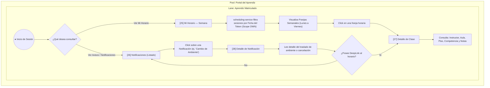

---

### PROCESO 11: Monitoreo Estratégico de KPIs, Drill-down y Alertas
> **Pantallas involucradas**: [29] Panel de indicadores, [30] Drill-down de KPI, [50] Catálogos de monitoreo.
> **Microservicio**: `monitoring-service` (KPI Aggregation Engine).

```mermaid
flowchart TD
    subgraph POOL_DIRECTOR_FLOW["Pool: Gobierno y Analítica Directiva"]
        direction TB
        subgraph LANE_DIRECTOR["Lane: Director de Centro"]
            START_DIR_KPI((● Inicio)) --> P29["[29] Panel de Indicadores"]
            P29 --> LOAD_KPIS["monitoring-service: Agrega métricas de 47 fichas formativas"]
            
            LOAD_KPIS --> VIEW_CARDS["Inspecciona tarjetas: En Seguimiento (31), En Riesgo (12), Crítico (4)"]
            VIEW_CARDS --> VIEW_BARS["Analiza Gráfico de Distribución por Nivel de Riesgo"]
            
            VIEW_BARS --> SELECT_FICHA_KPI["Click en Ficha con Alerta Crítica (ej. Ficha 2874412 Asistencia)"]
            SELECT_FICHA_KPI --> P30["[30] Drill-down de KPI"]
            
            P30 --> VIEW_TIMELINE["Visualiza Gráfico de Evolución Temporal (Marzo a Julio 2026)"]
            VIEW_TIMELINE --> COMPARE_THRESHOLD["Compara Valor Actual (76%) vs Umbral Mínimo (80%)"]
            
            COMPARE_THRESHOLD --> DEC_DIR_DECISION{Decisión Directiva}
            DEC_DIR_DECISION -- Solicitar Plan de Mejoramiento --> DISPATCH_PLAN["monitoring-service: Genera requerimiento a Coordinación"]
            DEC_DIR_DECISION -- Ajustar Umbral Institucional --> P50["[50] Ir a Parametrización de Monitoreo"]
            
            DISPATCH_PLAN --> END_DIR(((● Gestión Directiva Completada)))
            P50 --> END_DIR
        end
    end
```

---

### PROCESO 12: Aprovisionamiento de Cuentas y Asignación RBAC
> **Pantallas involucradas**: [31] Usuarios — lista, [32] Crear / editar usuario, [33] Detalle de usuario, [34] Modal asignar / revocar rol, [53] RBAC.
> **Microservicio**: `iam-service` + `audit-service`.

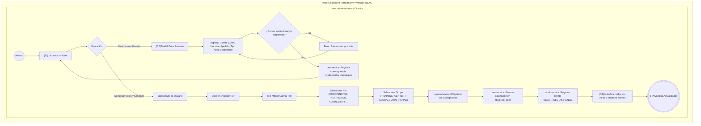

---

### PROCESO 13: Generación Asíncrona de Documentos y Plantillas
> **Pantallas involucradas**: [37] Documentos — lista, [38] Plantillas, [41] Detalle de documento + versiones, [42] Modal generar documento, [43] Editor / preview de plantilla.
> **Microservicio**: `document-service` (Handlebars PDF/Excel Renderer) + `S3/Blob Storage`.

```mermaid
flowchart TD
    subgraph POOL_DOC_MGMT["Pool: Generación Documental y Plantillas"]
        direction TB
        subgraph LANE_SUPPORT_DOC["Lane: Administrador de Soporte (Back-Office)"]
            START_DOC((● Inicio)) --> DEC_DOC_ACT{¿Qué desea gestionar?}
            
            DEC_DOC_ACT -- Diseñar / Editar Plantilla --> P38["[38] Plantillas de Documento"]
            P38 --> CLICK_EDIT_TPL["Selecciona Plantilla (ej. CONSTANCIA_HORARIO)"]
            CLICK_EDIT_TPL --> P43["[43] Editor / Preview de Plantilla"]
            P43 --> WRITE_HANDLEBARS["Edita marcado HTML + Handlebars: `{{ficha_number}}`, `{{period}}`"]
            WRITE_HANDLEBARS --> TEST_RENDER["Click en 'Previsualizar' con Mock JSON"]
            TEST_RENDER --> SAVE_TPL["document-service: Incrementa versión (v3 -> v4 PUBLISHED)"]
            
            DEC_DOC_ACT -- Generar Documento --> P37["[37] Documentos — Lista"]
            P37 --> CLICK_GEN["Click en 'Generar Documento'"]
            CLICK_GEN --> P42["[42] Modal Generar Documento"]
            
            P42 --> INPUT_GEN_DATA["Selecciona Plantilla, Dominio, Servicio e ingresa UUID de la Entidad"]
            INPUT_GEN_DATA --> DISPATCH_GEN["Click en 'Generar'"]
            
            DISPATCH_GEN --> ASYNC_GEN["document-service: Inicia Job Asíncrono (Status: GENERATING)"]
            ASYNC_GEN --> RENDER_JOB{¿Procesamiento exitoso?}
            
            RENDER_JOB -- Error de Datos --> SET_FAIL["Status: GENERATION_FAILED (Botón Reintentar)"] --> P37
            RENDER_JOB -- Exitoso --> STORE_BLOB["Almacena PDF en Storage y crea versión inmutable"]
            STORE_BLOB --> SET_AVAIL["Status: AVAILABLE"]
            
            SET_AVAIL --> P41["[41] Detalle de Documento + Versiones"]
            P41 --> CLICK_DOWNLOAD["Click en 'Descargar Versión Vigente'"]
            CLICK_DOWNLOAD --> GET_PRESIGNED["document-service: Emite URL Firmada Temporal de Descarga"]
            GET_PRESIGNED --> END_DOC(((● Archivo Descargado)))
        end
    end
```

---

### PROCESO 14: Parametrización Maestra Estructural
> **Pantallas involucradas**: [46] Hub de parametrización, [47] Currículo, [48] Jornadas, [49] Ambientes, [50] Monitoreo, [51] Estados de actores, [52] Geografía institucional, [35, 36, 40, 45] Catálogos.
> **Microservicio**: `reference-service` + `academic-service` + `environment-service` + `monitoring-service` + `actors-service`.

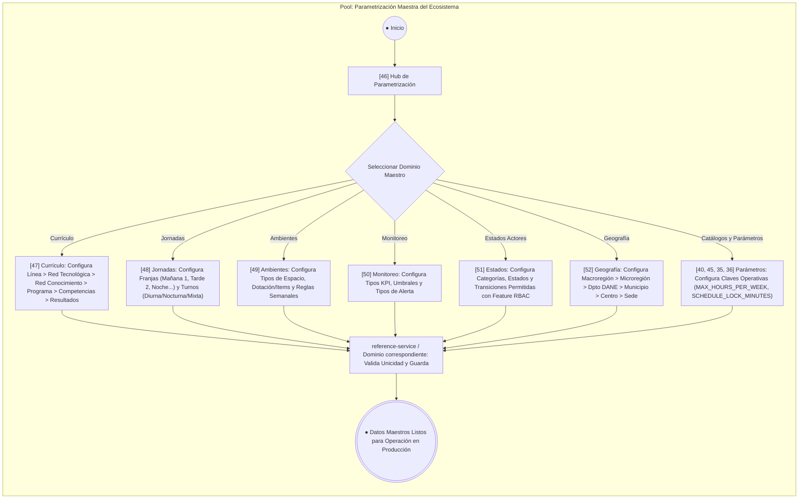

---

## 4. Matriz de Cobertura Total: 53 Pantallas vs 14 Procesos BPMN

| # | Pantalla / Modal | Rol Principal | Microservicio | Proceso BPMN Asignado |
|---|---|---|---|---|
| **1** | Login | `public` | `iam-service` | **Proceso 01**: Autenticación y Acceso |
| **2** | Recuperar contraseña | `public` | `iam-service` | **Proceso 01**: Autenticación y Acceso |
| **3** | Nueva contraseña | `public` | `iam-service` | **Proceso 01**: Autenticación y Acceso |
| **4** | App Shell por rol | Todos | `shell` / Gateway | **Proceso 02**: Navegación y RBAC |
| **5** | Panel de notificaciones | Todos | `monitoring-service` | **Proceso 02**: Navegación y RBAC |
| **6** | Estados globales (403, 404, 500, Sesión) | Todos | `shell` / Gateway | **Proceso 01** y **Proceso 02** |
| **7** | Dashboard / Inicio | `coordinator` | `shell` / `scheduling` | **Proceso 03**: Formulación de Horarios |
| **8** | Horarios — lista | `coordinator` | `scheduling-service` | **Proceso 03**: Formulación de Horarios |
| **9** | Detalle de horario (Publicado) | `coordinator` | `scheduling-service` | **Proceso 06**: Publicación de Horarios |
| **10** | Crear / editar horario | `coordinator` | `scheduling-service` | **Proceso 03, 04, 05, 06** |
| **11** | Modal agregar / editar sesión | `coordinator` | `scheduling-service` | **Proceso 03**: Formulación de Horarios |
| **12** | Modal confirmar publicación | `coordinator` | `scheduling-service` | **Proceso 06**: Publicación de Horarios |
| **13** | Panel de conflictos | `coordinator` | `scheduling-service` | **Proceso 04** y **Proceso 05** |
| **14** | Modal resolver conflicto | `coordinator` | `scheduling-service` | **Proceso 05**: Resolución de Conflictos |
| **15** | Disponibilidad | `coordinator` | `environment-service` | **Proceso 07** y **Proceso 08** |
| **16** | Detalle de ambiente | `coordinator` | `environment-service` | **Proceso 07**: Gestión de Ambientes |
| **17** | Fichas — lista | `coordinator` | `academic-service` | **Proceso 03**: Formulación de Horarios |
| **18** | Detalle de ficha | `coordinator` | `academic-service` | **Proceso 03**: Formulación de Horarios |
| **19** | Mi horario — semana | `instructor` | `scheduling-service` | **Proceso 09**: Operación Docente |
| **20** | Detalle de sesión (Drawer) | `instructor` | `scheduling-service` | **Proceso 09**: Operación Docente |
| **21** | Mi disponibilidad | `instructor` | `actors-service` | **Proceso 08**: Trámite de Excepciones |
| **22** | Modal crear excepción | `instructor` | `actors-service` | **Proceso 08**: Trámite de Excepciones |
| **23** | Seguimiento de ficha | `instructor` | `monitoring-service` | **Proceso 09**: Operación Docente |
| **24** | Registrar seguimiento | `instructor` | `monitoring-service` | **Proceso 09**: Operación Docente |
| **25** | Mi horario — semana | `learner` | `scheduling-service` | **Proceso 10**: Portal del Aprendiz |
| **26** | Notificaciones | `learner` | `monitoring-service` | **Proceso 10**: Portal del Aprendiz |
| **27** | Detalle de clase | `learner` | `scheduling-service` | **Proceso 10**: Portal del Aprendiz |
| **28** | Detalle de notificación | `learner` | `monitoring-service` | **Proceso 10**: Portal del Aprendiz |
| **29** | Panel de indicadores | `director` | `monitoring-service` | **Proceso 11**: Analítica Directiva |
| **30** | Drill-down de KPI | `director` | `monitoring-service` | **Proceso 11**: Analítica Directiva |
| **31** | Usuarios — lista | `director` / `support` | `iam-service` | **Proceso 12**: Gestión de Identidad |
| **32** | Crear / editar usuario | `director` / `support` | `iam-service` | **Proceso 12**: Gestión de Identidad |
| **33** | Detalle de usuario | `director` / `support` | `iam-service` | **Proceso 01** y **Proceso 12** |
| **34** | Modal asignar / revocar rol | `director` / `support` | `iam-service` | **Proceso 12**: Gestión de Identidad |
| **35** | Datos de referencia | `director` | `reference-service` | **Proceso 14**: Parametrización Maestra |
| **36** | Editar catálogo / parámetro | `director` | `reference-service` | **Proceso 14**: Parametrización Maestra |
| **37** | Documentos — lista | `support` | `document-service` | **Proceso 13**: Generación Documental |
| **38** | Plantillas de documento | `support` | `document-service` | **Proceso 13**: Generación Documental |
| **39** | Auditoría | `support` | `audit-service` | **Proceso 01, 05, 06, 12** |
| **40** | Parametrización / catálogos | `support` | `reference-service` | **Proceso 14**: Parametrización Maestra |
| **41** | Detalle de documento + versiones | `support` | `document-service` | **Proceso 13**: Generación Documental |
| **42** | Modal generar documento | `support` | `document-service` | **Proceso 13**: Generación Documental |
| **43** | Editor / preview de plantilla | `support` | `document-service` | **Proceso 13**: Generación Documental |
| **44** | Modal detalle de auditoría | `support` | `audit-service` | **Proceso 05, 06, 12** |
| **45** | CRUD catálogo / valor | `support` | `reference-service` | **Proceso 14**: Parametrización Maestra |
| **46** | Hub de parametrización | `director` / `support` | `reference-service` | **Proceso 14**: Parametrización Maestra |
| **47** | Currículo académico | `director` / `support` | `academic-service` | **Proceso 14**: Parametrización Maestra |
| **48** | Jornadas / franjas horarias | `director` / `support` | `scheduling-service` | **Proceso 14**: Parametrización Maestra |
| **49** | Tipos de ambiente e inventario | `director` / `support` | `environment-service` | **Proceso 07** y **Proceso 14** |
| **50** | Catálogos de monitoreo | `director` / `support` | `monitoring-service` | **Proceso 11** y **Proceso 14** |
| **51** | Estados de actores | `director` / `support` | `actors-service` | **Proceso 08** y **Proceso 14** |
| **52** | Geografía institucional | `director` / `support` | `reference-service` | **Proceso 14**: Parametrización Maestra |
| **53** | RBAC — roles y permisos | `director` / `support` | `iam-service` | **Proceso 02** y **Proceso 12** |
