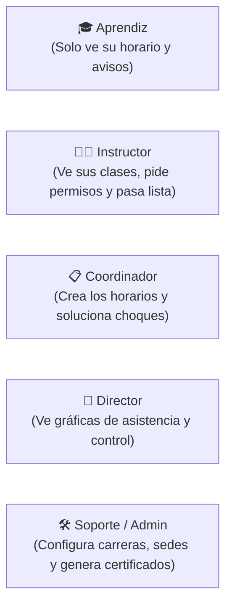
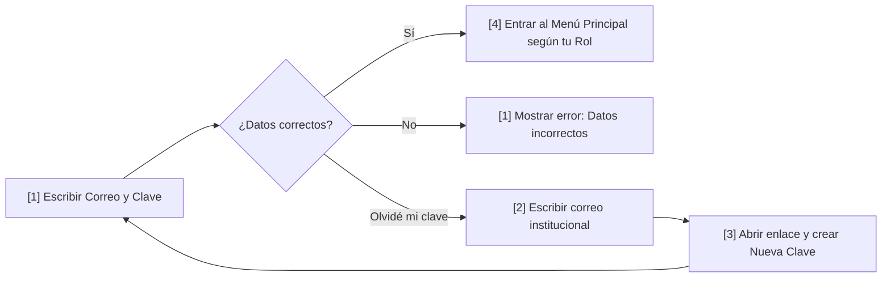
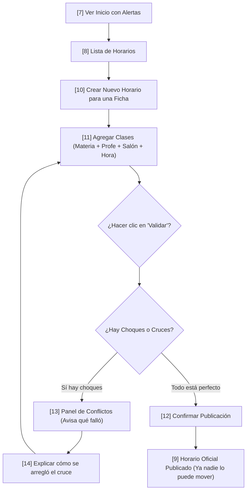
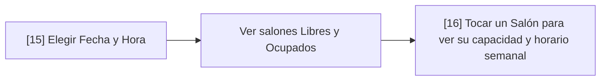
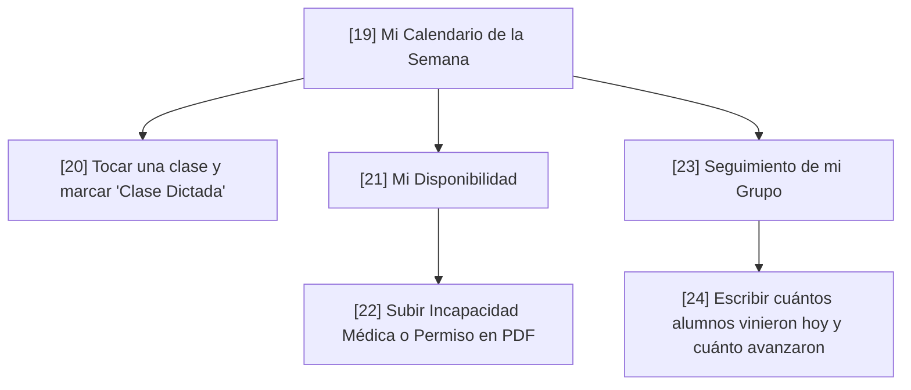
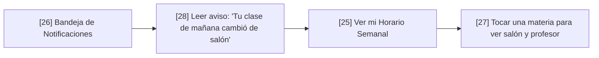
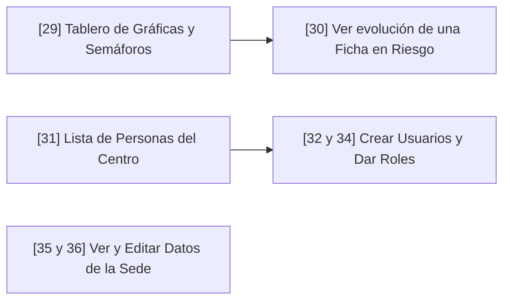
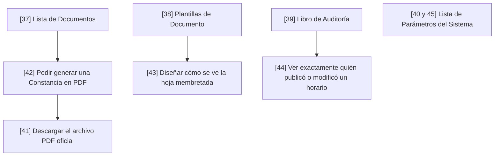
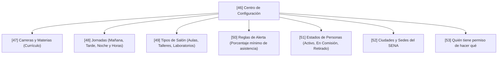

# Guía Fácil y Visual de Procesos — SENA: Gestión de Horarios
## ¿Cómo funciona el sistema? Explicado para cualquier persona (Paso a Paso y Pantalla por Pantalla)

---

## 🌟 1. La Idea General (En 1 Minuto)

Imagina que organizar los horarios del SENA es como **armar un rompecabezas gigante**:
- Hay **cientos de aprendices** organizados en grupos (*fichas*).
- Hay **decenas de instructores** con diferentes especialidades y contratos.
- Hay **aulas, talleres y laboratorios** con cupos limitados.

> **¿Qué hace este sistema?**
> Evita el caos. Hace que el coordinador arme los horarios fácilmente en la computadora, el sistema le avisa si dos profesores van a usar el mismo salón a la misma hora (*conflicto*), permite resolverlo y, una vez publicado, le llega el horario exacto al celular del aprendiz y del profesor.

---

## 👥 2. Los 5 Protagonistas (¿Quién es quién?)

1. **El Aprendiz (Laura)**: Entra a ver qué clases tiene hoy, en qué aula le toca y si le cancelaron o cambiaron alguna sesión.
2. **El Instructor (Juan)**: Ve su semana de trabajo, marca si dio la clase, pasa asistencia y si se enferma o tiene cita médica, sube su incapacidad.
3. **El Coordinador (María)**: Es quien arma los horarios. Junta ficha + profesor + salón + hora. Si hay un cruce, lo arregla y publica el horario oficial.
4. **El Director (Carlos)**: No arma horarios. Mira el "tablero de control" con semáforos (verde, amarillo, rojo) para ver si los aprendices están yendo a clase o si hay riesgo de que abandonen la carrera.
5. **El Administrador / Soporte (Ana)**: Prepara todo antes de empezar: crea las carreras, las sedes, las materias, los salones y saca constancias en PDF.

---

## 🔄 3. Los 8 Flujos de la Vida Real (Explicados Fácil)

---

### Flujo 1: Cómo entra la gente al sistema (Pantallas 1 a 6)
**¿Qué pasa aquí?** El usuario inicia sesión de forma segura y, si olvida su clave, la recupera.

* **Pantalla 1**: Donde pones tu correo `@sena.edu.co` y contraseña.
* **Pantalla 2**: Pides que te manden un correo para recuperar tu clave.
* **Pantalla 3**: Creas tu nueva contraseña segura.
* **Pantalla 4**: La pantalla principal con el menú que te corresponde.
* **Pantalla 5**: La campanita de notificaciones que te avisa novedades.
* **Pantalla 6**: Pantallas de aviso si no tienes permiso (403) o si la página no existe (404).

---

### Flujo 2: El Coordinador arma un Horario y arregla Cruces (Pantallas 7 a 14 y 17-18)
**¿Qué pasa aquí?** El coordinador crea el horario de un grupo, agrega las clases y el sistema revisa que no haya errores antes de publicarlo.

* **Pantalla 7**: El inicio del coordinador que le muestra cuántos horarios faltan y qué problemas hay.
* **Pantalla 8**: La lista de todos los horarios del centro.
* **Pantalla 9**: Ver el horario final ya publicado (en modo solo lectura).
* **Pantalla 10**: La hoja de trabajo donde se arma el horario borrador.
* **Pantalla 11**: La ventana donde eliges qué profesor dará qué materia en qué salón.
* **Pantalla 12**: La ventana final para confirmar y publicar el horario a todo el mundo.
* **Pantalla 13**: El semáforo de conflictos (te dice si un profesor tiene 2 clases a la misma hora o si el salón está ocupado).
* **Pantalla 14**: La ventana donde escribes cómo solucionaste el choque (por ejemplo: *"Se pasó la clase al aula B-105"*).
* **Pantalla 17 y 18**: Lista y detalle de los grupos de aprendices (*Fichas*).

---

### Flujo 3: Cómo se revisan y apartan los Salones (Pantallas 15 y 16)
**¿Qué pasa aquí?** Antes de poner una clase, el coordinador revisa qué aulas o talleres están libres.

* **Pantalla 15**: Buscador de disponibilidad (pones *"Lunes 7:00 a 10:00 AM"* y te muestra qué salones están desocupados).
* **Pantalla 16**: Muestra la ficha técnica del salón: cuántas sillas tiene, si los computadores funcionan y su calendario semanal.

---

### Flujo 4: El día a día del Profesor / Instructor (Pantallas 19 a 24)
**¿Qué pasa aquí?** El profesor mira qué clases tiene en la semana, pide permisos si se enferma y lleva el control de asistencia.

* **Pantalla 19**: El horario semanal del profesor tipo calendario.
* **Pantalla 20**: Pestaña lateral para marcar si dio la clase o si se canceló.
* **Pantalla 21**: Lista de permisos e incapacidades del profesor.
* **Pantalla 22**: Formulario para subir el certificado médico en PDF y pedir el permiso.
* **Pantalla 23**: Tabla para ver si los aprendices están asistiendo a clase.
* **Pantalla 24**: Formulario donde el profesor pone: *"Hoy asistieron 20 de 25 alumnos y vimos el tema de Bases de Datos"*.

---

### Flujo 5: El Aprendiz revisando su Horario (Pantallas 25 a 28)
**¿Qué pasa aquí?** El aprendiz entra desde su computador o celular a revisar su horario y sus notificaciones.

* **Pantalla 25**: El horario personal del aprendiz (solo ve el de su grupo, no el de otros).
* **Pantalla 26**: Mensajes y avisos importantes.
* **Pantalla 27**: Datos completos de la clase (nombre del profesor, piso y bloque del salón).
* **Pantalla 28**: Detalle del aviso con botón para ir directo a la clase modificada.

---

### Flujo 6: El Director vigilando el Centro (Pantallas 29 a 36)
**¿Qué pasa aquí?** El director de sede revisa que las clases se estén dictando y que no haya deserción de alumnos.

* **Pantalla 29**: Tablero con tarjetas de colores: cuántos grupos van bien, cuántos están en riesgo y cuántos en estado crítico.
* **Pantalla 30**: Gráfica que muestra mes a mes si la asistencia subió o bajó.
* **Pantalla 31 a 34**: Directorio de cuentas para crear profesores, coordinadores y asignar permisos.
* **Pantalla 35 y 36**: Datos de la sede principal (dirección, teléfono y reglas del centro).

---

### Flujo 7: El Administrador sacando Constancias y Plantillas (Pantallas 37 a 45)
**¿Qué pasa aquí?** Se generan documentos oficiales (como la constancia de horarios en PDF) y se revisa el historial de quién hizo qué.

* **Pantalla 37**: Lista de certificados y reportes listos para descargar.
* **Pantalla 38**: Modelos de documentos (plantillas oficiales).
* **Pantalla 39**: Registro de auditoría (como una caja negra que anota cada clic importante).
* **Pantalla 40 y 45**: Opciones avanzadas de configuración.
* **Pantalla 41**: Hoja de descarga segura del documento en PDF.
* **Pantalla 42**: Ventana para ordenar la creación de un nuevo documento.
* **Pantalla 43**: Editor visual para cambiar el diseño de las constancias.
* **Pantalla 44**: Ventana que muestra los datos técnicos de un cambio para saber quién lo hizo.

---

### Flujo 8: La Configuración Inicial / Cimientos (Pantallas 46 a 53)
**¿Qué pasa aquí?** Antes de poder armar cualquier horario, se debe alimentar la base del sistema (carreras, materias, salones, jornadas).

---

## 📋 4. La Tabla Completa de las 53 Pantallas (En Palabras Sencillas)

| # | Nombre de la Pantalla | ¿Quién la usa? | ¿Para qué sirve en palabras sencillas? |
|:---:|---|---|---|
| **1** | Login | Todos | La puerta de entrada: pones correo y contraseña. |
| **2** | Recuperar contraseña | Todos | Si olvidaste tu clave, pides que te manden un enlace al correo. |
| **3** | Nueva contraseña | Todos | Escribes tu nueva clave para volver a entrar. |
| **4** | App Shell por rol | Todos | La estructura de la página (barra arriba, menú al lado). |
| **5** | Panel de notificaciones | Todos | La campanita que te muestra tus avisos recientes. |
| **6** | Estados globales | Todos | Mensajes cuando algo falla (ej. *"No tienes permiso"* o *"Error 404"*). |
| **7** | Dashboard / Inicio | Coordinador | Resumen del día: cuántos horarios faltan y qué alertas hay. |
| **8** | Horarios — lista | Coordinador | Tabla con todos los horarios del centro para buscar y filtrar. |
| **9** | Detalle de horario | Coordinador | Ver un horario ya terminado y publicado (solo lectura). |
| **10** | Crear / editar horario | Coordinador | La mesa de trabajo donde armas el horario de un grupo. |
| **11** | Modal agregar sesión | Coordinador | Ventana donde asignas profesor, salón y materia a una hora. |
| **12** | Modal confirmar publicación | Coordinador | El botón final para aprobar el horario y enviárselo a todos. |
| **13** | Panel de conflictos | Coordinador | Te muestra si hay dos profesores en el mismo salón o choques. |
| **14** | Modal resolver conflicto | Coordinador | Ventana donde explicas cómo arreglaste el choque de horario. |
| **15** | Disponibilidad | Coordinador | Buscador para saber qué salones y profesores están libres hoy. |
| **16** | Detalle de ambiente | Coordinador | Muestra la capacidad, sillas y horario semanal de un salón. |
| **17** | Fichas — lista | Coordinador | Lista de todos los grupos de estudiantes del centro. |
| **18** | Detalle de ficha | Coordinador | Datos de un grupo específico: cuántos alumnos son y qué estudian. |
| **19** | Mi horario — semana | Instructor | El calendario semanal de clases del profesor. |
| **20** | Detalle de sesión | Instructor | Pestaña donde el profesor marca si dictó la clase o no. |
| **21** | Mi disponibilidad | Instructor | Lista de permisos e incapacidades médicas del profesor. |
| **22** | Modal crear excepción | Instructor | Formulario para pedir permiso y adjuntar la incapacidad en PDF. |
| **23** | Seguimiento de ficha | Instructor | Tabla para ver cómo va la asistencia del grupo. |
| **24** | Registrar seguimiento | Instructor | Formulario donde el profesor anota cuántos vinieron hoy a clase. |
| **25** | Mi horario — semana | Aprendiz | El horario del alumno: ve sus clases de lunes a viernes. |
| **26** | Notificaciones | Aprendiz | Buzón con avisos de cambios de salón o cancelaciones. |
| **27** | Detalle de clase | Aprendiz | Muestra qué profesor le toca, en qué salón y qué piso. |
| **28** | Detalle de notificación | Aprendiz | El mensaje completo que explica por qué cambió la clase. |
| **29** | Panel de indicadores | Director | Semáforos y gráficas de cómo va el centro educativo. |
| **30** | Drill-down de KPI | Director | Gráfica para ver si la asistencia de un grupo mejoró o empeoró. |
| **31** | Usuarios — lista | Director / Admin | Lista de todas las personas registradas en el sistema. |
| **32** | Crear / editar usuario | Director / Admin | Formulario para registrar un nuevo profesor o coordinador. |
| **33** | Detalle de usuario | Director / Admin | Ver el perfil de alguien, qué rol tiene y desde dónde se conectó. |
| **34** | Modal asignar / revocar rol | Director / Admin | Ventana para darle permiso a alguien de ser Coordinador o Profe. |
| **35** | Datos de referencia | Director | Información de la sede: dirección, ciudad y teléfonos. |
| **36** | Editar catálogo / parámetro | Director | Ajustar reglas de la sede (ej. máximo de horas semanales). |
| **37** | Documentos — lista | Soporte | Archivos oficiales generados listos para descargar. |
| **38** | Plantillas de documento | Soporte | Modelos de cartas y constancias oficiales en PDF. |
| **39** | Auditoría | Soporte | El libro de registros que anota cada acción para seguridad. |
| **40** | Parametrización / catálogos | Soporte | Tablas de configuración general del sistema. |
| **41** | Detalle de documento | Soporte | Ver quién generó un PDF y descargarlo de forma segura. |
| **42** | Modal generar documento | Soporte | Ventana para pedirle al sistema que fabrique una constancia. |
| **43** | Editor de plantilla | Soporte | Diseñador para cambiar el texto y logo de las constancias. |
| **44** | Modal detalle de auditoría | Soporte | Muestra los datos técnicos exactos de quién hizo un cambio. |
| **45** | CRUD catálogo / valor | Soporte | Crear opciones nuevas en los menús desplegables. |
| **46** | Hub de parametrización | Admin / Director | El menú principal de todas las configuraciones base. |
| **47** | Currículo académico | Admin / Director | Árbol de carreras, materias y temas que enseña el SENA. |
| **48** | Jornadas / franjas | Admin / Director | Horarios del centro: Mañana (7-10), Tarde (1-4), Noche (6-9). |
| **49** | Tipos de ambiente | Admin / Director | Definir qué es un aula, un laboratorio o un taller de soldadura. |
| **50** | Catálogos de monitoreo | Admin / Director | Configurar las alertas (ej. avisar si la asistencia baja de 80%). |
| **51** | Estados de actores | Admin / Director | Definir estados: Alumno Activo, Graduado, Retirado, etc. |
| **52** | Geografía institucional | Admin / Director | Ciudades, departamentos y sedes donde opera el centro. |
| **53** | RBAC — roles y permisos | Admin / Director | La tabla maestra de qué botones puede tocar cada rol. |
